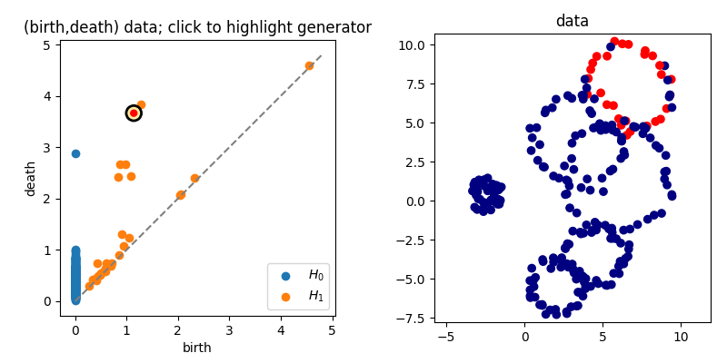

# What is this?

This is a collection of scripts taking baby steps* towards building an interactive tool to associate
topological features - in particular loops/voids - with some reasonable subset of the data
which is "responsible" (aka, a generator). Here the topological features are represented by birth/death pairs.

\**Yes, I'm aware of how git works, but I prefer to have hard checkpoints for increasingly complex functionality.*

# Requirements
* numpy (I'm on version 1.18.3 but earlier versions are probably fine)
* matplotlib (I'm on version 3.0.3)
* cechmate (version 0.0.8) and phat (version ???). These were set up when I did a `pip install` of scikit-tda, but you may need to install them explicitly.
* pybind11

# Getting started
Just run `mpl_generator_interactivity_ex0.py` in ipython or a jupyter notebook. The main class powering the most up to date version is in `int_gen.py`. The rest of the scripts are my baby steps in building up from the sample code in https://matplotlib.org/3.1.1/users/event_handling.html#object-picking towards the specific functionality I want.
